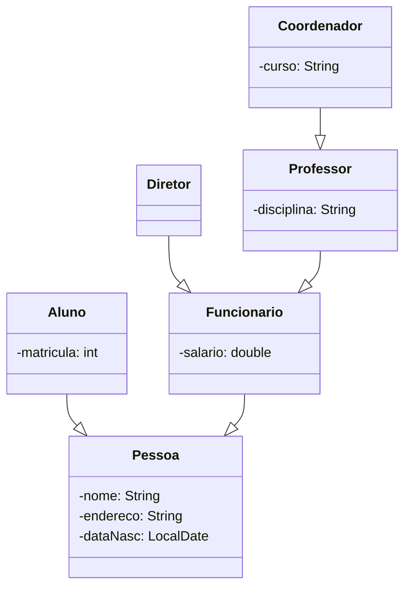

## Sistema acadêmico



## Sistema de livraria

````mermaid

classDiagram

    class Obra{
        -id: String
        -paginas: int
        -edicao: String
        -titulo: String
    }
    class Livro{
        -ISBN: int
        -autor: String
    }
    class Revista{
        -ISSN: int
    }
    class Jornal{
        
    }
    class Gibi{
        -ilustradores: String
    }
    
    class Periodicos{
        
    }
    
    Periodicos --|> Obra
    Gibi --|> Revista
    Livro --|> Obra
    Revista --|> Periodicos
    Jornal --|> Periodicos

````