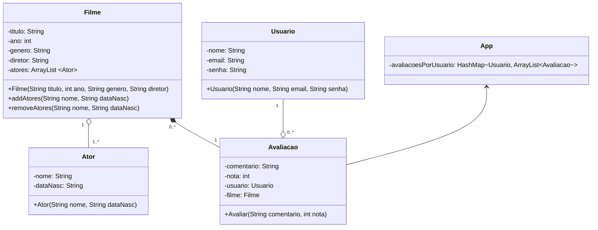

# Diagrama de classe UML

## Sistema de avaliações de filmes

```mermaid
classDiagram
    
    class Filme{
        -titulo: String
        -ano: int
        -genero: String
        -diretor: String
        -atores: ArrayList ~Ator~
        +Filme(String titulo, int ano, String genero, String diretor)
        +addAtores(String nome, String dataNasc)
        +removeAtores(String nome, String dataNasc)
    }
    
    class Ator{
        -nome: String
        -dataNasc: String
        +Ator(String nome, String dataNasc)
    }

    class Avaliacao{
        -comentario: String
        -nota: int
        -usuario: Usuario
        -filme: Filme
        +Avaliar(String comentario, int nota)
    }
    
    class Usuario{
        -nome: String
        -email: String
        -senha: String
        +Usuario(String nome, String email, String senha)
    }
    
    class App{
        -avaliacoesPorUsuario: HashMap~Usuario, ArrayList~Avaliacao~~
    }

    Filme "1" o-- "1..*" Ator
    Filme "0..*" *-- "1" Avaliacao
    Usuario "1" --o "0..*" Avaliacao
    App <-- Avaliacao


```